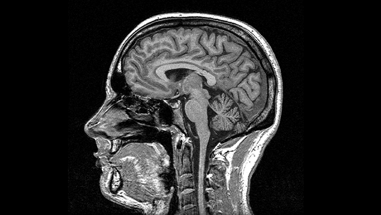
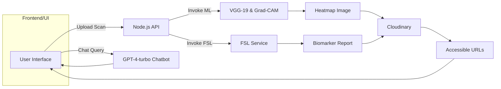

# Vaidya Nidaan
*'Vaidya Nidaan' translates from Sanskrit as "Medical Diagnosis".*

> 🏅 **3rd Place** (among 400+ teams) at PICT Techfiesta 2025 Hackathon


> **Vaidya Nidaan** is a machine learning based diagnostic assistance system for Alzheimer’s detection using MRI scans, biomarker extraction with FSL, and explainability via Grad-CAM. The platform integrates VGG-19 for classification, FSL for biomarker computation, and GPT-4-turbo for an interactive multilingual chatbot (English, Hindi, Marathi, any regional Indian language).

---

## 🔍 Features

- **MRI Classification**: 95 % accuracy Alzheimer’s detection with a fine-tuned VGG-19 model.
- **Explainability**: Grad-CAM++ heatmap overlays highlight impacted regions.
- **Biomarker Extraction**: Automated volume metrics & statistical biomarkers via FSL.
- **Multilingual Chatbot**: GPT-4-turbo RAG chatbot providing support to Indian regional languages as well.
- **Scalable Storage**: Multer for local uploads & Cloudinary for cloud-based image hosting.
- **Secure Backend**: Node.js API with JWT auth in HTTP-only cookies and PostgreSQL via Prisma.

---

## 📦 Repository Structure

The system is split into three services — a **React frontend**, a **Node.js API gateway**, and a **Python ML/inference service** — plus the original research artifacts.

```text
vaidya-nidaan/
├── website/
│   ├── backend/                    # Node.js + Express API (auth + patient records)
│   │   ├── middleware/             # JWT auth middleware, Multer upload config
│   │   ├── models/                 # Mongoose schemas (Doctor, Patient)
│   │   ├── routes/                 # doctorRoutes (auth), patientRoutes (CRUD)
│   │   ├── server.js               # Entrypoint (auto in-memory MongoDB fallback)
│   │   ├── .env.example
│   │   └── package.json
│   └── frontend/                   # React + Vite single-page application
│       └── src/
│           ├── api.js              # Central API_BASE / ML_BASE configuration
│           ├── pages/              # Landing, Login, Signup, Dashboard, Profile,
│           │                       #   AlzheimerDetection, GRAD-CAM, BiomarkerAnalysis,
│           │                       #   DiagnosisReport, Chatbot
│           └── components/         # PrivateRoute (JWT guard)
├── ml_service/                     # Python Flask inference service
│   ├── app.py                      # HTTP API: prediction, gradcam, report, diagnosis, chat
│   ├── inference.py                # VGG-19 classifier + Grad-CAM++ (TensorFlow)
│   ├── report.py                   # FSL biomarker analysis (BET + FAST)
│   ├── chatbot.py                  # GPT-4o multilingual chatbot + clinical rationale
│   ├── diagnosis.py                # Combined diagnosis report orchestration
│   ├── config.py                   # Env loading + Hugging Face model download
│   ├── requirements.txt
│   └── .env.example
├── research/                       # Original notebooks & scripts (training, Grad-CAM, FSL, RAG)
│   ├── notebooks/                  # final_alzheimer_model, chatbot_rag, report
│   └── scripts/                    # feature_image_model, gradcam_plus_plus, fsl_report
├── docs/
│   ├── images/                     # README screenshots (banner, architecture, heatmap…)
│   └── samples/                    # Sample MRI scan + example FSL report
├── start-all.sh                    # One-command launcher for all three services
├── RUN_LOCAL.md                    # Detailed local-run guide & troubleshooting
└── README.md
```

---

## 🚀 Installation

### Prerequisites
- **Node.js** 18+ and **npm**
- **Python** 3.12 (recommended for TensorFlow wheels on macOS arm64 / Linux)
- **FSL** (FMRIB Software Library) — optional, only for biomarker analysis; auto-detected from `~/fsl`. Install per the [official docs](https://fsl.fmrib.ox.ac.uk/fsl/fslwiki/FslInstallation).
- **No database to install** — an in-memory MongoDB starts automatically (set `MONGO_URI` for persistence).

### 1. Clone the repository
```bash
git clone https://github.com/malharinamdar/vaidya-nidaan.git
cd vaidya-nidaan
```

### 2. Backend — Node.js API gateway
```bash
cd website/backend
npm install
cp .env.example .env          # defaults work out of the box
```

### 3. Frontend — React + Vite
```bash
cd ../frontend
npm install
```

### 4. ML service — Python Flask (VGG-19 · Grad-CAM++ · FSL · GPT-4o)
```bash
cd ../../ml_service
python3.12 -m venv .venv
./.venv/bin/python -m pip install -r requirements.txt
cp .env.example .env          # then add your HF_TOKEN and OPENAI_API_KEY
```

---

## ⚙️ Configuration

**`website/backend/.env`**
```ini
PORT=5005
JWT_SECRET=change_me
# Leave empty to use an automatic in-memory MongoDB; set a mongodb:// URI to persist data.
MONGO_URI=
```

**`ml_service/.env`**
```ini
PORT=5001

# Trained VGG-19 model — downloaded from a (private) Hugging Face repo on first use.
HF_TOKEN=hf_xxx                 # needs READ access to the model repo
ALZHEIMER_MODEL_REPO=malharinamdar/alzheimer-prediction-model
ALZHEIMER_MODEL_FILE=alzheimer_model.h5
MODEL_PREPROCESS=raw            # matches how the model was trained (0–255 pixels)

# FSL biomarker analysis (auto-detected from ~/fsl if left blank)
FSLDIR=

# Multilingual GPT-4 chatbot + clinical rationale
OPENAI_API_KEY=sk-xxx
OPENAI_MODEL=gpt-4o             # vision-capable (handles MRI image questions)
```

> The frontend talks to the backend (`:5005`) and ML service (`:5001`) by default;
> override with `VITE_API_BASE` / `VITE_ML_BASE` in `website/frontend/.env` if needed.
> If `HF_TOKEN` cannot read the model repo, the classifier transparently falls back to a
> deterministic stand-in so the pipeline still runs — `GET /health` reports which backend is active.

---

## 💻 Running the Application

**One command (from the repo root):**
```bash
./start-all.sh
```

**…or run each service in its own terminal:**
```bash
# Terminal 1 — ML service
cd ml_service && ./.venv/bin/python app.py

# Terminal 2 — Backend API gateway
cd website/backend && npm start

# Terminal 3 — Frontend
cd website/frontend && npm run dev
```

| Service   | URL                     |
|-----------|-------------------------|
| Frontend  | `http://localhost:5173` |
| Backend   | `http://localhost:5005` |
| ML service| `http://localhost:5001` |

Open **http://localhost:5173**, sign up as a doctor, log in, add a patient, then open the patient
profile to use **Detect Alzheimer's**, **Grad-CAM Analysis**, **Biomarker Analysis**, **Full Diagnosis
Report**, and **Chat with AI**.

See [RUN_LOCAL.md](RUN_LOCAL.md) for a deeper guide and troubleshooting.

---

## 🛠️ Usage Examples

### 1. Authenticate
```bash
# Register a doctor
curl -X POST http://localhost:5005/api/doctors/signup \
  -H "Content-Type: application/json" \
  -d '{"name":"Dr Test","email":"dr@test.com","password":"pass123","specialty":"Neurologist"}'

# Log in and capture the JWT
TOKEN=$(curl -s -X POST http://localhost:5005/api/doctors/login \
  -H "Content-Type: application/json" \
  -d '{"email":"dr@test.com","password":"pass123"}' | python3 -c "import sys,json;print(json.load(sys.stdin)['token'])")
```

### 2. Alzheimer's classification (VGG-19)
```bash
curl -X POST http://localhost:5001/prediction -F "file=@docs/samples/MRI_blackandwhite.png"
```
```json
{
  "prediction": {
    "prediction": "Non Demented",
    "alzheimer_probability": 1.03,
    "per_class": {
      "Non Demented": 98.97,
      "Very mild Dementia": 0.0,
      "Mild Dementia": 0.0,
      "Moderate Dementia": 1.03
    },
    "message": "Predicted class: Non Demented (trained model)."
  }
}
```

### 3. Grad-CAM++ explainability
```bash
curl -X POST http://localhost:5001/gradcam -F "file=@docs/samples/MRI_blackandwhite.png"
# -> { "gradCamResult": "data:image/png;base64,…", "mriUrl": "data:image/png;base64,…" }
```

### 4. FSL biomarker analysis
```bash
curl -X POST http://localhost:5001/report -F "file=@docs/samples/MRI_blackandwhite.png"
```
```json
{
  "source": "FSL (BET + FAST)",
  "biomarkers": {
    "brain_volume_mm3": 1402624.0,
    "csf_fraction_pct": 29.31,
    "grey_matter_fraction_pct": 34.57,
    "white_matter_fraction_pct": 36.12,
    "gm_wm_ratio": 0.957,
    "brain_parenchymal_fraction_pct": 70.69
  },
  "report": "🏥 MRI Biomarker Analysis Report ..."
}
```

### 5. Full structured diagnosis report (prediction + Grad-CAM++ + biomarkers + LLM rationale)
```bash
curl -X POST http://localhost:5001/api/patients/<patientId>/diagnosis \
  -F "file=@docs/samples/MRI_blackandwhite.png" \
  -F 'patient={"name":"John Doe","age":72,"gender":"Male"}'
```
```json
{
  "prediction": { "prediction": "Non Demented", "alzheimer_probability": 1.03, "per_class": { "...": "..." } },
  "gradcam": { "gradCamResult": "data:image/png;base64,…", "mriUrl": "data:image/png;base64,…" },
  "biomarker_source": "FSL (BET + FAST)",
  "biomarkers": { "grey_matter_fraction_pct": 34.57, "gm_wm_ratio": 0.957, "csf_fraction_pct": 29.31 },
  "rationale": "### Model Prediction\nThe VGG-19 classifier predicts 'Non Demented' (98.97%)… the grey-matter fraction and GM:WM ratio are consistent with preserved cortical tissue…",
  "report": "VAIDYA NIDAAN — STRUCTURED MEDICAL DIAGNOSIS REPORT …",
  "classifier_backend": "tensorflow"
}
```

### 6. Multilingual chatbot
```bash
# Text question
curl -X POST http://localhost:5001/api/query2 -F "text=What is the hippocampus?"
# Image + question (GPT-4o vision)
curl -X POST http://localhost:5001/api/query1 \
  -F "text=Analyse this brain MRI." -F "file=@docs/samples/MRI_blackandwhite.png"
# -> { "message": "This is a sagittal MRI view of the brain… (observational analysis)" }
```

#### Sample Inputs & Outputs

**Input MRI Scan**



**Grad-CAM Heatmap**


**Chatbot Interface**


---

## 🔧 System Architecture



```mermaid
flowchart LR
  subgraph Frontend/UI
    U[User Interface]
  end
  U -->|Upload Scan| A[Node.js API]
  A -->|Invoke ML| B[VGG-19 & Grad-CAM]
  A -->|Invoke FSL| C[FSL Service]
  B --> D[Heatmap Image]
  C --> E[Biomarker Report]
  D & E --> F[Cloudinary]
  F --> G[Accessible URLs]
  G --> U
  U -->|Chat Query| H[GPT-4-turbo Chatbot]
  H --> U
```  

---

## 📄 License

This project is licensed under the MIT License. See [LICENSE](LICENSE) for details.

---
## 📬 Contact

**Team MarkerMinds AI**

**Team Members:**
- Malhar Inamdar (Maintainer of this repo) – <malhar.inamdar.097@gmail.com>  
- Manorama Mudgal  
- Vedant Joshi  
- Prajwal Mandlecha  
- Aditya Bhalgat  

🌐 Web: [malharinamdar.github.io](https://malharinamdar.github.io)
