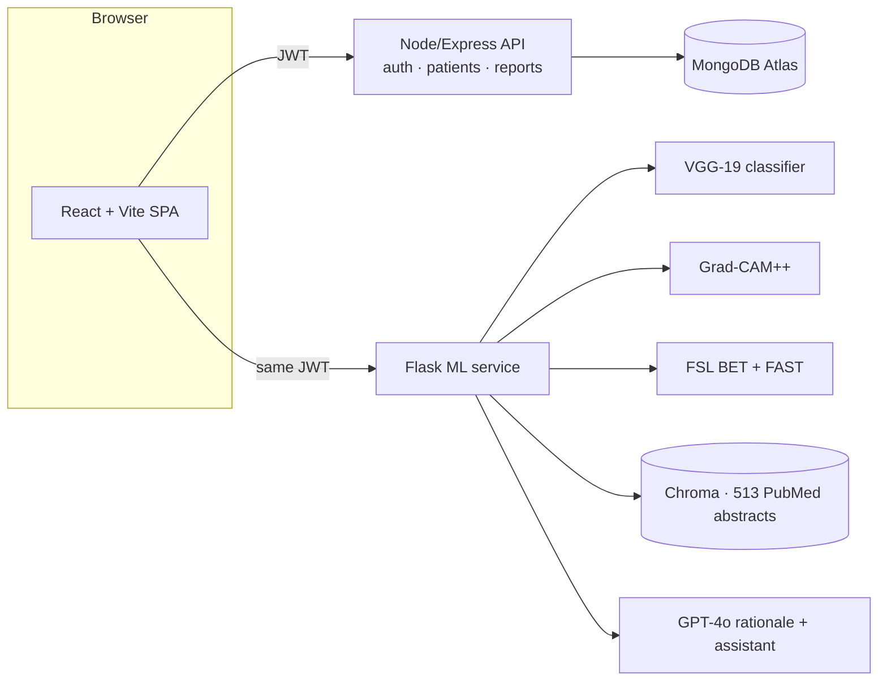

# Vaidya Nidaan

*"Vaidya Nidaan" is Sanskrit for "medical diagnosis".*

> 🏅 **3rd place** of 400+ teams at PICT Techfiesta 2025
>
> **Live demo → [vaidya-nidaan.vercel.app](https://vaidya-nidaan.vercel.app)** (click *Try the demo* — no sign-up)

**Explainable decision support for Alzheimer's MRI.** Upload one axial brain-MRI slice and Vaidya Nidaan:

1. **classifies** it (Demented vs Non-demented) with a transfer-learned VGG-19,
2. **explains** the decision with Grad-CAM++ you can fade over the anatomy,
3. **measures** tissue composition with FSL (BET + FAST),
4. **drafts a clinical rationale** with GPT-4o, grounded in PubMed/MEDLINE abstracts it retrieves and cites,

…and saves everything as a printable report in the patient's history. A multilingual assistant (English, Hindi,
Marathi, …) answers follow-up questions with PubMed citations; conversations are saved per patient.


| Patient workspace · Grad-CAM++ | Printable diagnosis report |
|---|---|
|  |  |
| **FSL tissue biomarkers** | **PubMed-grounded assistant** |
|  |  |

---

## What's inside

| Layer | What it does |
|---|---|
| **Classifier** | VGG-19 (ImageNet transfer learning) + dense head (256 → 128 → softmax) on 128 × 128 axial slices; binary decision, Demented vs Non-demented. |
| **Explainability** | Grad-CAM++ on `block5_conv4`, computed on the pre-softmax **log-odds** of the predicted class (softmax gradients vanish on confident predictions), rendered as an adjustable overlay. |
| **Tissue biomarkers** | FSL BET + FAST (3-class, T1) with partial-volume-weighted tissue amounts: CSF / grey / white-matter fractions, GM:WM ratio and parenchymal fraction for 2D slices, plus volumes for 3D NIfTI uploads. |
| **RAG** | 513 PubMed/MEDLINE abstracts (NCBI E-utilities) in a persisted ChromaDB index with cosine retrieval and an out-of-domain refusal floor, used by both the report rationale and the assistant. `eval_rag.py` checks retrieval relevance, citation and refusal (9/9). |
| **Clinical rationale** | GPT-4o writes a structured interpretation — impression, classifier and Grad-CAM++ interpretation, tissue biomarkers vs Alzheimer's atrophy patterns, risk profile, a synthesis of 5 retrieved PubMed abstracts with [n] citations, differential diagnosis and recommended work-up. |
| **Assistant** | GPT-4o chat with conversation memory, image attachments and PubMed grounding; conversations are stored in MongoDB per patient. |
| **Caching** | Deterministic outputs (classification, Grad-CAM++, FSL, full report, repeated questions) are cached by input hash — Redis when `REDIS_URL` is set, else in-process. A repeat request drops from ~4 s to a few ms. |
| **Input guard** | A deterministic plausibility filter (greyscale, dark background, tissue present) rejects photos and screenshots before the model runs. |

### Data and training

- **Data:** OASIS-1 cross-sectional MRI — axial T1 slices from 347 subjects (81 with CDR ≥ 0.5, 266 with CDR 0).
- **Notebooks:** [`final_alzheimer_model.ipynb`](research/notebooks/final_alzheimer_model.ipynb) trains the current model;
  [`alzheimer_model_v2.ipynb`](research/notebooks/alzheimer_model_v2.ipynb) is the v2 pipeline — patient-level train/val/test split,
  class weights over the full 86k-slice imagesOASIS set, ImageNet preprocessing, block5 fine-tuning with augmentation, and
  slice- plus patient-level evaluation. [`report.ipynb`](research/notebooks/report.ipynb) prototypes the FSL biomarker report.

---

## Architecture


```mermaid
flowchart LR
  subgraph Browser
    UI[React + Vite SPA]
  end
  UI -- JWT --> API[Node/Express API<br/>auth · patients · reports]
  API --> DB[(MongoDB Atlas)]
  UI -- same JWT --> ML[Flask ML service]
  ML --> CLS[VGG-19 classifier]
  ML --> CAM[Grad-CAM++]
  ML --> FSL[FSL BET + FAST]
  ML --> RAG[(Chroma · 513 PubMed abstracts)]
  ML --> LLM[GPT-4o rationale + assistant]
```

- **Frontend** — React 18, Vite, Tailwind v4, Framer Motion. It has one patient workspace (upload a scan once; every tab reuses it) and a print-to-PDF report view.
- **API gateway** — Express + Mongoose. It handles JWT auth (a Bearer token in localStorage), patient CRUD, saved reports, and a one-click shared demo workspace (`DEMO_MODE`).
- **ML service** — Flask on [Modal](https://modal.com) (scale-to-zero). Every POST route verifies the gateway's JWT and is rate-limited per caller.
- **Hosting** — frontend and API on Vercel, database on MongoDB Atlas.

## Run locally

Prerequisites: Node 18+, Python 3.12, and optionally [FSL](https://fsl.fmrib.ox.ac.uk/fsl/docs/#/install/index) (auto-detected at `~/fsl`; without it, biomarkers fall back to image statistics).

```bash
git clone https://github.com/malharinamdar/vaidya-nidaan.git && cd vaidya-nidaan

# API gateway
cd website/backend && npm install && cp .env.example .env   # set JWT_SECRET; MONGO_URI optional
npm run init-db                                              # indexes + demo workspace (needs MONGO_URI)

# Frontend
cd ../frontend && npm install

# ML service
cd ../../ml_service && python3.12 -m venv .venv && ./.venv/bin/pip install -r requirements.txt
cp .env.example .env   # set ALZHEIMER_MODEL_PATH (or HF_TOKEN), OPENAI_API_KEY, and the SAME JWT_SECRET

cd .. && ./start-all.sh   # frontend :5173 · API :5005 · ML :5001
```

With `MONGO_URI` empty, the API starts an in-memory MongoDB (nothing is persisted). Open http://localhost:5173 and click **Try the demo**.

## Repository

```text
website/frontend   React SPA (pages/, components/, lib/)
website/backend    Express API (app.js, routes/, models/, lib/, api/index.js for Vercel)
ml_service         Flask ML service (app.py, inference.py, report.py, diagnosis.py,
                   chatbot.py, medical_rag.py, security.py, mri_check.py, modal_app.py)
research           Training notebooks (v1, v2), FSL report notebook, Grad-CAM++ and FSL scripts
docs               Screenshots, sample scans, architecture diagrams
```

## Team

**Team MarkerMinds** — Malhar Inamdar (maintainer · [malharinamdar.github.io](https://malharinamdar.github.io)), Manorama Mudgal, Vedant Joshi, Prajwal Mandlecha, Aditya Bhalgat.
